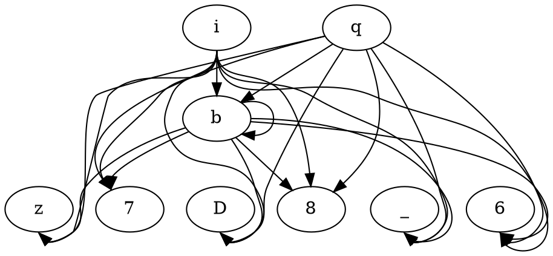
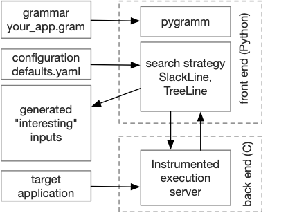

# SlackLine


Finding slow input faster using mutational splicing and application provided context-free grammar. 

Given an instrumented target application and grammar, SlackLine uses
our grammar module to annotate the grammar with a cost. It then uses
the grammar to generate derivations bound by some pre-defined
length (budget). SlackLine uses input splicing and MCTS to drive the
search toward more expensive inputs. 

## Related Publication(s):

- **Finding Short Slow Inputs Faster with Grammar-Based Search** ([pre-print-copy]()). Please use the reference below when citing the paper.

  > Ziyad Alsaeed and Michal Young. 2023. Finding Short Slow Inputs Faster with Grammar-Based Search. _In Proceedings of the 32nd ACM SIGSOFT International Symposium on Software Testing and Analysis (ISSTA ’23), July 17–21, 2023, Seattle, WA, United States_. ACM, New York, NY, USA, 11 pages. https://doi.org/10.1145/3597926.3598118

## How _SlackLine_ Works:

Following [Nautilus](https://github.com/nautilus-fuzz/nautilus),
our mutator can "splice" a previously generated 
subtree at any non-terminal in the grammar. These previously 
generated subtrees are kept in the "chunk_store", following the 
chunkstore structure in Nautilus. Like Nautilus, we record 
previously generated trees (actually just hashes of the strings they 
generate) so we don't waste time testing the same string over and over.

Key differences include 
- No bells and whistles.  No havoc. There are only three ways to 
  get a new string: 
  - Splice a previously generated subtree into the current tree
  - Replace any subtree at a non-terminal with a randomly generated 
    subtree
  - Generate a new random tree from the root (really a special case 
    of the second approach)
- Length control: This is critical for performance fuzzing, and not 
  for finding other kinds of bugs.  We never generate a string that 
  is longer than a fixed limit, which can be in characters or in 
  tokens. But we also do not minimize inputs as Nautilus and AFL 
  do: We want strings that are pretty close to the limit.

## Getting Started:

- Cloning this repository:
  
  The provided repository has submodules. Therefore, you have to
  clone it appropriately (e.g., use the `--recurse-submodules` flag).

- Build the Docker image:

  The back end instrumented execution of an application must take 
  place in a Docker container. This must be built once. When
  building the docker image, you have two options. First, building
  it from this repo. Second, building it from the docker repository.

  - **Option 1**: Build from Dockerfile 
  
    The command below uses the [Dockerfile](Dockerfile) given to build
    the image from scratch. Note that it will take a long time (~10-20 min)
    as we build AFL and each target application.

    ```shell
    docker build -t slackline-img:latest .
    ```
  - **Option 2**: Build from Docker Repository

    The command below simply uses our docker repo to download a built image.
    Please note that the rest of the documentation assumes you follow _Option-1_.
    Thus, you should adjust the image and container naming when following this
    option to avoid any naming conflict.
    
    ```shell
    docker pull zalsaeed/slackline
    ```

- Run a new container

  After it has been built, it can be started in Docker, like this
  ```shell
  docker run -p 2300:2300 --name slackline -it slackline-img /bin/bash
  ```
  This publishes port `2300`, which can then be reached either within 
  the Docker container or from the host machine (e.g., from an 
  Intel-based Mac laptop for testing). But before we can test input 
  generation for a particular application, we need an instrumented 
  version of that application running under the test harness in the 
  Docker container. For example, to experiment with an instrumented 
  version of GraphViz, we need to build and run the instrumented 
  version of GraphViz. The build process is described within
  shell script for each established target application
  ([this is the GraphViz build script](target_apps/graphviz/build.sh)).

- Run the AFL listener for a target application:

  Using the commands provided as sample on each target application
  README file ([wf](target_apps/word-frequency/README.md), [libxml](target_apps/libxml2/README.md),
  [lunasvg](target_apps/lunasvg/README.md), [graphviz](target_apps/graphviz/README.md),
  [flex](target_apps/flex/README.md)), run the AFL listener for that target app.
  ```shell
  afl-socket -i /home/slackline/target_apps/graphviz/inputs/ -o /home/results/graphviz-001 -p -N 500 -d dot
  ```

  Note that the instrumented harness is stateful (it remembers the 
  coverage and performance records that have been observed), so a fresh 
  experiment requires quitting the harness and restarting it in the 
  Docker console for the container. 

- Run _SlackLine_'s algorithm:

  To run the search process you have two options.
  - **Option 1**: Run from your local machine.
    
    Run [slackline.py](src/slackline.py) with the configuration you want (see [defaults.yaml](src/defaults.yaml)) form your local machine.
    This means that you are responsible for all python's dependencies. 
    ```shell
    python3 slackline.py 
    ```
  - **Option 2**: Use the same container to run the [slackline.py](src/slackline.py).
    
    Open another bash screen on the same container you have up and running.
    ```shell
    docker exec -it slackline /bin/bash
    ```
    Then navigate to `/home/slackline/src` and run _SlackLine_ as you would on your local machine. 
    ```shell
    python3 slackline.py
    ```
    
  Note that the [defaults.yaml](src/defaults.yaml) configuration files is set to run GraphViz
  for one hour. You should change the configurations according to your run goal.   

## Detailed Description of a Sample Outputs::

A five seconds run on GraphViz, could generate something similar to the directory list in the sample below
(default `/tmp/slackline/<experiment-id>`).
Note we removed some of the generated inputs here for brevity. 

```text
.
|-- list
|   |-- id:00000001-cost:0000050030-exec:00000001-hs:1808-crtime:1684322423777-dur:11+cost
|   |-- ...
|   |-- id:00000098-cost:0000107852-exec:00000146-hs:1808-crtime:1684322424940-dur:1174+cov
|   |-- id:00000099-cost:0000095064-exec:00000150-hs:1808-crtime:1684322424962-dur:1196+quant
|   |-- id:00000100-cost:0000830775-exec:00000151-hs:17757-crtime:1684322424979-dur:1213+cost
|   |-- id:00000101-cost:0001006458-exec:00000152-hs:22176-crtime:1684322424999-dur:1233+cost
|   |-- ...
|   `-- id:00000251-cost:0000246459-exec:00000558-hs:2664-crtime:1684322428775-dur:5009+cov
|-- report.txt
|-- settings.yaml
`-- summary.txt
```

The output can be described as the following:
- **list/**: Is the directory where all the generated inputs are saved. For each input we track a set of data points that we
    use for naming it. Note we only save interesting inputs (+cov, +quant, +cost).
  - `id`: The input sequence.
  - `cost`: The total number of edge hits that the input exercised.
  - `exec`: The number of execution from the beginning of the run until the generation of this input.
  - `hs` (hot-spot): the count of edge hits for the edge that was hit the most. 
  - `crtime`: Creation time of the input.
  - `dur` (duration): The time it toke to generate the given input since the beginning of th run in milliseconds.
  - `+cov`: The input exercised some new coverage.
  - `+quant`: The input is in the top quantile (tdigest ranking) 
  - `+cost`: The input exercised some new cost.
- **report.txt**: A full report of the search progress.  
- **settings.yaml**: The exact configurations used for running this experiment in case we want to regenerate it. 
- **summary.txt**: The run high-level observations (see sample below).

The most expensive input can be found by sorting the input based on `cost` or find the last input that
exercised a `+cost`. In the case of the five seconds run there would not be enough time to find an actual
expensive input. Nevertheless, below we show the content of the input named
`id:00000101-cost:0001006458-exec:00000152-hs:22176-crtime:1684322424999-dur:1233+cost`. 



In addition, here is a sample of the **summary.txt** file content.
It briefly describes the characteristics of the search attempt.

```text
  *** Summary of search ***

  Results logged to /tmp/slackline/app:graphviz-gram:parser-based-crtime:1684322423/list
  261 nodes on search frontier
  5 sweeps of frontier
  1_006_458 highest execution cost encountered
  194 (34.8%) occurrences new coverage (AFL bucketed criterion)
  9 (1.6%) occurrences new max count on an edge (AFL mod in TreeLine and PerfFuzz)
  21 (3.8%) occurrences new max of edges executed (measure of execution cost)
  27 (4.8%) retained for being relatively costly
  ---
  607 attempts to generate a mutant
  463 (76.3%) spliced hybrids  
  144 (23.7%) random generation 
  607  mutants generated by splicing OR randomly expanding a node
  49 (8.1%) stale mutants (duplicated previously generated string)
  558 (91.9%) valid (not duplicate) mutants submitted for execution
  ---
  193 (41.7%) progress from splicing
  58 (40.3%) progress from random subtree generation
  ---
```

### Collecting Cost in CSV File

To collect the all the inputs information in an easy to handle CSV file, you could use the
[collect_costs.py](src/collect_costs.py) script. The script provides an easy-to-use bulk
data collection process. However, be aware that it could take a long time if the majority
of the inputs are expensive (timing out). To run the script you only need to specify the
directory where the experiment(s) are saved and the location to the instrumented binary
file. For our example, it could look like this. 

```shell
python3 collect_costs.py /tmp/slackline/ dot
```

The results will be saved to the same directory, and it will be similar to the CSV sample
below.

```csv
id,exec,crtime,dur,mtime(seconds),size(byte),cost,hotspot,coverage
000001,00000000001,1685176283422,0000000062,1685176283.422196,28,63048,1806,3937
000002,00000000002,1685176283443,0000000083,1685176283.4431958,21,51421,1806,2426
000003,00000000003,1685176283449,0000000089,1685176283.448196,21,51455,1806,2435
000004,00000000004,1685176283453,0000000093,1685176283.454196,29,51519,1806,2439
...
```

## Extending _SlackLine_:

_SlackLine_ (and its companion _TreeLine_), are built modularly, allowing for a complete change in the search strategy.
The basic functionalities like running inputs and reading and annotating grammar are in separate modules. One can
either extend the search strategy of _SlackLine_ or replace _SlackLine_ as a whole.

<p align="center"></p>


## Dependencies:

All the dependencies are managed by the docker file provided. However, a major requirements for building and running
_SlackLine_ is to build it on x86 processor. This is required for AFL's instrumentation to work.

## Known Issues:

- **Cores of Linux as a host**:
  
  If you host the docker image on a Linux distribution, make sure `core_pattern` is set to `core` in the host machine,
  as given in the command below.

  ```shell
  sudo sysctl -w kernel.core_pattern="core"
  ```

  Otherwise, AFL will complain with an error similar to the one below. 

  ```shell
  [*] Checking core_pattern...
  
  [-] Hmm, your system is configured to send core dump notifications to an
      external utility. This will cause issues: there will be an extended delay
      between stumbling upon a crash and having this information relayed to the
      fuzzer via the standard waitpid() API.
  
      To avoid having crashes misinterpreted as timeouts, please log in as root
      and temporarily modify /proc/sys/kernel/core_pattern, like so:
  
      echo core >/proc/sys/kernel/core_pattern
  ```
