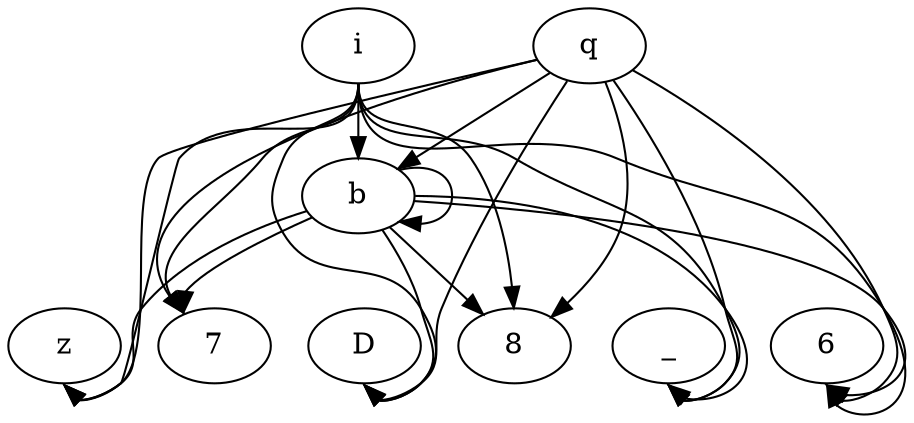

# SlackLine


Finding slow input faster using mutational splicing and application provided context-free grammar. 

This is a testing version of the code _SlackLine_ (the exact code used for experimentation). We are aware that it is not
user-friendly. The repository will change drastically after paper submission. We will refactor most of the code and
add all the necessary documentation.

## Related Publication(s):

TBA

## How _SlackLine_ Works:

At this time we know of no grammar-based mutational fuzzers 
aimed at finding performance bugs.  There are good text mutation 
fuzzers for performance bugs (PerfFuzz) and good grammar-based
mutational fuzzers (Nautilus), but modifying either to combine their 
attributes is not straightforward.  

### Nautilus

We looked in particular at
[Nautilus](https://github.com/nautilus-fuzz/nautilus), because in
addition to being a very good fuzzer for its intended domain, it
had enough in common with [TreeLine](https://github.com/uo-se-research/treeline)
to seem an apt basis for comparison between tree search (Monte
Carlo or otherwise) and grammar-based mutation.

However, the implementation of Nautilus is in rust, and its 
integration with an AFL++ back end (vs AFL code base for PerfFuzz 
and TreeLine) is a shared memory area. Thus, it is very tightly 
coupled to the in-memory data structure of the coverage structure 
that AFL++ builds (which is probably compatible with AFL, but we 
aren't sure). TreeLine uses additional memory structures, adopted 
from PerfFuzz. In particular, while AFL (and AFL++, presumably) 
buckets edge counts in a way that treats 301 and 311 as the same count
(i.e., an execution that touches an edge 311 times is not 
necessarily "new coverage" if the edge has previously been touched 
301 times), PerfFuzz and TreeLine keep total counts for each edge so 
that touching an edge more times than it has been touched before 
(even if in the same bucket) can be treated as progress toward 
finding expensive runs or hot spots. 

We were not confident of correctly modifying Nautilus to use the 
additional information produced by our modified AFL back-end.  In 
addition, Nautilus has other optimizations and operations (including 
some textual mutation with "havoc"), and a rust application with a 
shared memory interface was not an "apples to apples" comparison 
with a Python application communicating over sockets.  This led us 
to borrow and reimplement key ideas from Nautilus in Python. 

### Our mutator (SlackLine)

Following Nautilus, our mutator can "splice" a previously generated 
subtree at any non-terminal in the grammar. These previously 
generated subtrees are kept in the "chunk_store", following the 
chunkstore structure in Nautilus.  Like Nautilus, we record 
previously generated trees (actually just hashes of the strings they 
generate) so we don't waste time testing the same string over and over.

Key differences include 
- No bells and whistles.  No havoc. There are only three ways to 
  get a new string: 
  - Splice a previously generated subtree into the current tree
  - Replace any subtree at a non-terminal with a randomly generated 
    subtree
  - Generate a new random tree from the root (really a special case 
    of the second approach)
- Length control: This is critical for performance fuzzing, and not 
  for finding other kinds of bugs.  We never generate a string that 
  is longer than a fixed limit, which can be in characters or in 
  tokens. But we also do not minimize inputs as Nautilus and AFL 
  do: We want strings that are pretty close to the limit.

## Usage:

- Build the Docker image:

  The back end instrumented execution of an application must take 
  place in a Docker container. This must be built once, like this: 

  ```shell
  docker build -t slackline-img:latest .
  ```
- Run a new container

  After it has been built, it can be started in Docker, like this
  ```shell
  docker run -p 2300:2300 --name slackline -it slackline-img /bin/bash
  ```
  This publishes port `2300`, which can then be reached either within 
  the Docker container or from the host machine (e.g., from an 
  Intel-based Mac laptop for testing). But before we can test input 
  generation for a particular application, we need an instrumented 
  version of that application running under the test harness in the 
  Docker container. For example, to experiment with an instrumented 
  version of GraphViz, we need to build and run the instrumented 
  version of GraphViz. The build process is described within
  shell script for each established target application
  ([this is the GraphViz build script](target_apps/graphviz/build.sh)).

- Run the AFL listener for a target application:

  Using the commands provided as sample on each target application
  README file([wf](target_apps/word-frequency/README.md), [libxml](target_apps/libxml2/README.md),
  [lunasvg](target_apps/lunasvg/README.md), [graphviz](target_apps/graphviz/README.md),
  [flex](target_apps/flex/README.md)), run the AFL listener for that target app.
  ```shell
  afl-socket -i /home/slackline/target_apps/graphviz/inputs/ -o /home/results/graphviz-001 -p -N 500 -d dot
  ```

  Note that the instrumented harness is stateful (it remembers the 
  coverage and performance records that have been observed), so a fresh 
  experiment requires quitting the harness and restarting it in the 
  Docker console for the container. 

- Run _SlackLine_'s algorithm:

  To run the search process you have two options.
  - **Option 1**: Run from your local machine
    
    Run [slackline.py](src/slackline.py) with the configuration you want (see [defaults.yaml](src/defaults.yaml)) form your local machine.
    This means that you are responsible for all python's dependencies. 
    ```shell
    python3 slackline.py 
    ```
  - **Option 2**: Use the same container to run the _SlackLine_
    
    Open another bash screen on the same container you have up and running.
    ```shell
    docker exec -it slackline /bin/bash
    ```
    Then navigate to `/home/slackline/src` and run _SlackLine_ as you would on your local machine. 
    ```shell
    python3 slackline.py
    ```

## Sample Output:

A five seconds run on GraphViz, could generate something similar to the directory list in the sample below
(default `/tmp/slackline/<experiment-id>`).
Note we removed some of the generated inputs here for brevity. 

```text
.
|-- list
|   |-- id:00000001-cost:0000050030-exec:00000001-hs:1808-crtime:1684322423777-dur:11+cost
|   |-- ...
|   |-- id:00000098-cost:0000107852-exec:00000146-hs:1808-crtime:1684322424940-dur:1174+cov
|   |-- id:00000099-cost:0000095064-exec:00000150-hs:1808-crtime:1684322424962-dur:1196+quant
|   |-- id:00000100-cost:0000830775-exec:00000151-hs:17757-crtime:1684322424979-dur:1213+cost
|   |-- id:00000101-cost:0001006458-exec:00000152-hs:22176-crtime:1684322424999-dur:1233+cost
|   |-- ...
|   `-- id:00000251-cost:0000246459-exec:00000558-hs:2664-crtime:1684322428775-dur:5009+cov
|-- report.txt
|-- settings.yaml
`-- summary.txt
```

The output can be described as the following:
- **list/**: Is the directory where all the generated inputs are saved. For each input we track a set of data points that we
    use for naming it. Note we only save interesting inputs (+cov, +quant, +cost).
  - `id`: The input sequence.
  - `cost`: The total number of edge hits that the input exercised.
  - `exec`: The number of execution from the beginning of the run until the generation of this input.
  - `hs` (hot-spot): the count of edge hits for the edge that was hit the most. 
  - `crtime`: Creation time of the input.
  - `dur` (duration): The time it toke to generate the given input since the beginning of th run in milliseconds.
  - `+cov`: The input exercised some new coverage.
  - `+quant`: The input is in the top quantile (tdigest ranking) 
  - `+cost`: The input exercised some new cost.
- **report.txt**: A full report of the search progress.  
- **settings.yaml**: The exact configurations used for running this experiment in case we want to regenerate it. 
- **summary.txt**: The run high-level observations (see sample below).

The most expensive input can be found by sorting the input based on `cost` or find the last input that
exercised a `+cost`. In the case of the five seconds run there would not be enough time to find an actual
expensive input. Nevertheless, below we show the content of the input named
`id:00000101-cost:0001006458-exec:00000152-hs:22176-crtime:1684322424999-dur:1233+cost`. 



In addition, here is a sample of the **summary.txt** file content.
It briefly describes the characteristics of the search attempt.  

```text
  *** Summary of search ***

  Results logged to /tmp/slackline/app:graphviz-gram:parser-based-crtime:1684322423/list
  261 nodes on search frontier
  5 sweeps of frontier
  1_006_458 highest execution cost encountered
  194 (34.8%) occurrences new coverage (AFL bucketed criterion)
  9 (1.6%) occurrences new max count on an edge (AFL mod in TreeLine and PerfFuzz)
  21 (3.8%) occurrences new max of edges executed (measure of execution cost)
  27 (4.8%) retained for being relatively costly
  ---
  607 attempts to generate a mutant
  463 (76.3%) spliced hybrids  
  144 (23.7%) random generation 
  607  mutants generated by splicing OR randomly expanding a node
  49 (8.1%) stale mutants (duplicated previously generated string)
  558 (91.9%) valid (not duplicate) mutants submitted for execution
  ---
  193 (41.7%) progress from splicing
  58 (40.3%) progress from random subtree generation
  ---
```

## Dependencies:

All the dependencies are managed by the docker file provided. However, a major requirements for building and running
_SlackLine_ is to build it on x86 processor. This is required for AFL's instrumentation to work. 
